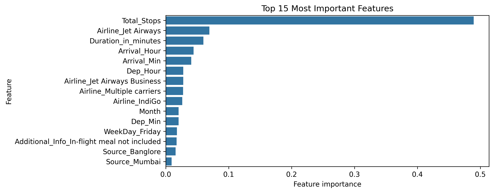
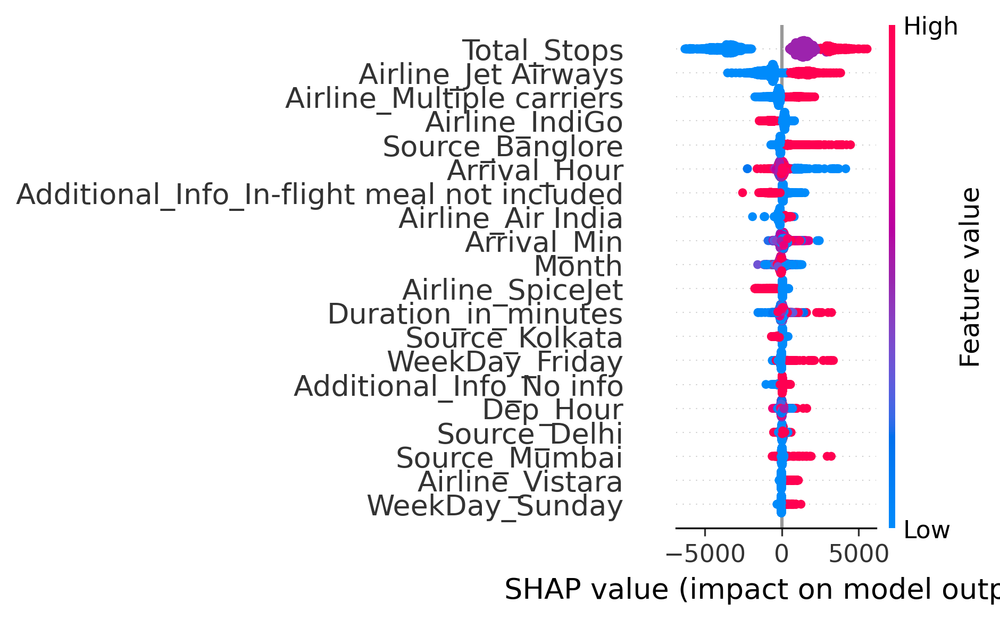
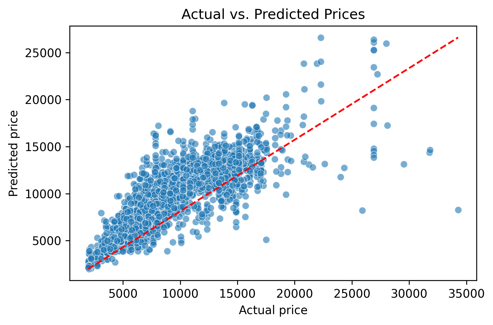
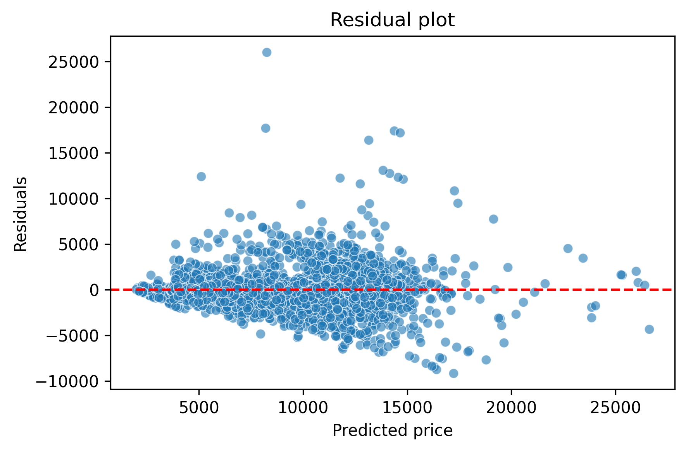

# Flight Price Prediction

An end-to-end machine learning project that predicts flight ticket prices using airline, route, schedule, and travel-related information. It demonstrates the complete machine learning workflow, including data preprocessing, exploratory data analysis (EDA), feature engineering, model comparison, hyperparameter tuning, and model interpretability using Feature Importance and SHAP.

---
## Project Overview

The objective of this project is to build a regression model capable of predicting flight ticket prices from historical flight information.

Three regression models were trained and compared using two different preprocessing strategies. After hyperparameter tuning and evaluation, the tuned Random Forest model achieved the best predictive performance with an R² score of approximately **0.737**.

---
## Dataset

The dataset contains historical flight booking information, including:

- Airline
- Source
- Destination
- Route
- Total Stops
- Departure Time
- Arrival Time
- Duration
- Additional Information
- Booking Date (Day and Month)
- Ticket Price (Target Variable)

Two preprocessing strategies were evaluated:

- **Dataset P:** Removed the **Day** feature while retaining all observations.
- **Dataset Q:** Retained the **Day** feature by removing observations with missing values.

---
## Workflow

### 1. Data Cleaning
- Handled missing values
- Removed duplicates
- Processed date and time features

### 2. Exploratory Data Analysis (EDA)
- Analyzed feature distributions
- Visualized relationships between features and ticket prices
- Compared preprocessing strategies

### 3. Feature Engineering
- Extracted departure and arrival hours/minutes
- Converted flight duration into minutes
- Recovered missing **Total Stops** values using information from the **Route** feature

### 4. Data Preprocessing
- Built preprocessing pipelines using **Pipeline** and **ColumnTransformer**
- Applied One-Hot Encoding to categorical features
- Evaluated two preprocessing strategies for handling missing **Day** values

### 5. Model Training
- Linear Regression
- Decision Tree Regressor
- Random Forest Regressor

### 6. Hyperparameter Tuning
- GridSearchCV
- Decision Tree
- Random Forest

### 7. Model Interpretation
- Feature Importance
- SHAP

---
## Model Performance

Three regression models were trained and evaluated using two different preprocessing strategies.

| Model | Dataset P (R²) | Dataset Q (R²) |
|--------|---------------:|---------------:|
| Linear Regression | 0.599 | 0.599 |
| Decision Tree (Tuned) | 0.637 | 0.636 |
| Random Forest | 0.730 | 0.725 |
| Random Forest (Tuned) | **0.737** | **0.732** |

The tuned Random Forest model trained on **Dataset P** achieved the highest predictive performance and was selected as the final model.

---
## Model Interpretation & Visualizations

### Feature Importance



### SHAP Summary Plot



### Actual vs Predicted Prices



### Residual Plot



---
## Technologies Used

- Python
- Pandas
- NumPy
- Matplotlib
- Seaborn
- Scikit-learn
- SHAP
- Joblib

---
## Repository Structure

```
Flight-Price-Prediction/
│
├── data/
│   └── flight_price.csv
│
├── images/
│   ├── feature_importance.png
│   ├── shap_summary.png
│   ├── actual_vs_predicted.png
│   └── residual_plot.png
│
├── Flight_Price_Prediction.ipynb
├── flight_price_model.pkl
├── feature_importance.csv
├── requirements.txt
└── README.md
```

---
## Installation

1. Clone the repository.

```bash
git clone https://github.com/Sugaryglitch/Flight-Price-Prediction.git
```

2. Navigate to the project directory.

```bash
cd Flight-Price-Prediction
```

3. Install the required dependencies.

```bash
pip install -r requirements.txt
```

4. Open the notebook and run all cells.

---
## Future Improvements

- Experiment with advanced ensemble models such as XGBoost and LightGBM.
- Deploy the trained model using Flask or Streamlit.
- Incorporate richer flight and booking information to improve predictive performance.
- Explore additional feature engineering techniques to further enhance model accuracy.

---
## Author

**Chinmayee Khuntia**